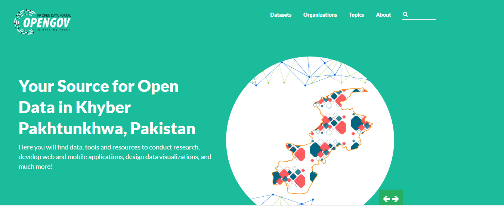
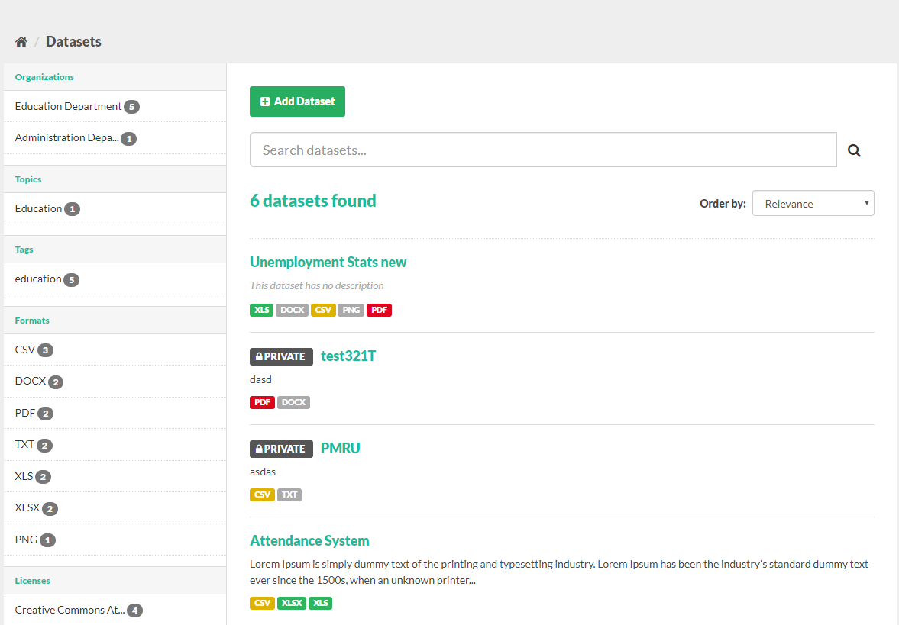
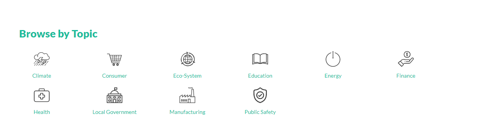

For detailed documentation, visit https://aliwaqas.gitbook.io/opendata-portal-documentation/


# ckanext-kpodp_theme

### http://opendata.kp.gov.pk CKAN theme


### Datasets Page


### Topics on front Page


# Installation:
- copy the zip file to `/usr/lib/ckan/default/src`
- cd `/usr/lib/ckan/default/src`
- run ``` python setup.py install ```
- After this has completed successfully, add `kpodp_theme` to ckan.plugins in ckan configuration file.

## Manually generating main.css
----------------------------

Run `sass ckanext/kpodp_theme/public/css/sass/main.scss ckanext/kpodp_theme/public/css/main.css`

